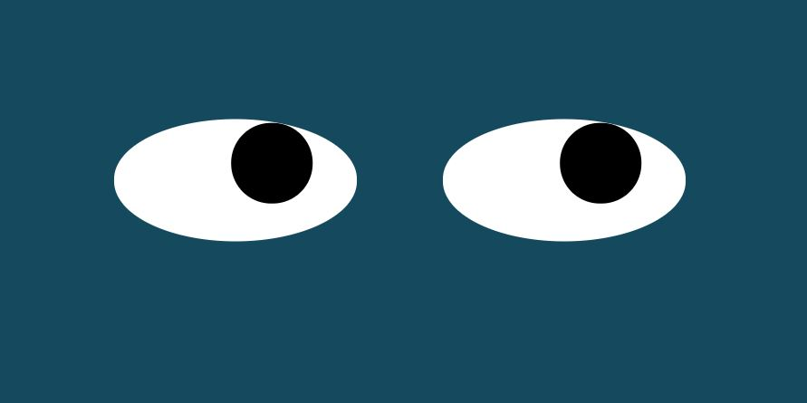

<h1>Eye Exercise</h1>

<h2>DESCRIPTION</h2>

This project uses vanilla JavaScript with 'onmousemove' event to trigger with the mouse moving on the window to move the "pupils" around the eyes.

<h2>How to run</h2>
<ul>
<li>Clone the repository into your local environment</li>
<li>Open the index.html file</li>
<li>Right click and select 'Open Default browser' to open the project in your default browser. </li>
</ul>

<h3>Roadmap of future improvements</h3>

Possibly making this a smaller face and more towards animated objects with different events allowed to allow different interactions like jump, walk, and change color.

<h3>Check it out:</h3>
<a href="https://elowskya.github.io/eyeExercise/">https://elowskya.github.io/eyeExercise/</a>

<h3>License Information</h3>
MIT License

Copyright (c) 2021 Ashley Elowsky

Permission is hereby granted, free of charge, to any person obtaining a copy
of this software and associated documentation files (the "Software"), to deal
in the Software without restriction, including without limitation the rights
to use, copy, modify, merge, publish, distribute, sublicense, and/or sell
copies of the Software, and to permit persons to whom the Software is
furnished to do so, subject to the following conditions:

The above copyright notice and this permission notice shall be included in all
copies or substantial portions of the Software.

THE SOFTWARE IS PROVIDED "AS IS", WITHOUT WARRANTY OF ANY KIND, EXPRESS OR
IMPLIED, INCLUDING BUT NOT LIMITED TO THE WARRANTIES OF MERCHANTABILITY,
FITNESS FOR A PARTICULAR PURPOSE AND NONINFRINGEMENT. IN NO EVENT SHALL THE
AUTHORS OR COPYRIGHT HOLDERS BE LIABLE FOR ANY CLAIM, DAMAGES OR OTHER
LIABILITY, WHETHER IN AN ACTION OF CONTRACT, TORT OR OTHERWISE, ARISING FROM,
OUT OF OR IN CONNECTION WITH THE SOFTWARE OR THE USE OR OTHER DEALINGS IN THE
SOFTWARE.

